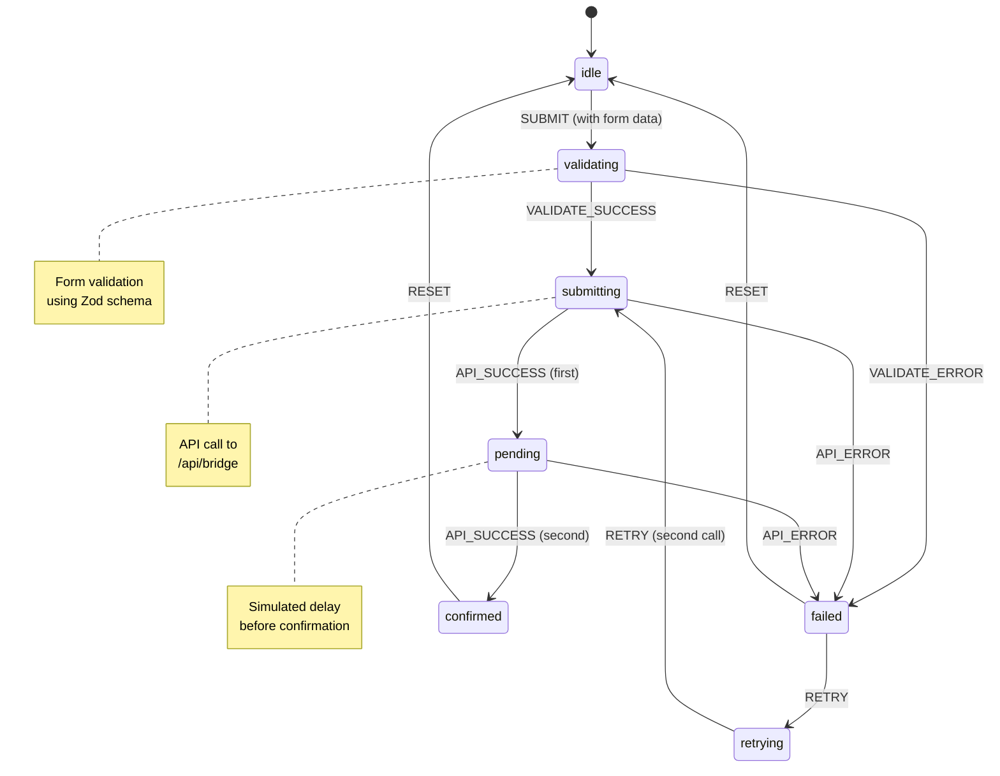

# Bridge Transaction State Diagram

## State Machine Overview

The bridge transaction flow uses a reducer-based state machine with seven states and explicit transitions. Below is a visual representation of the state flow.

## Mermaid Diagram



## State Transitions

### Initial State: `idle`
- **Description**: No active transaction
- **UI**: Bridge form visible, submit button enabled
- **Transitions**: 
  - `SUBMIT` → `validating`

### State: `validating`
- **Description**: Form data is being validated using Zod schema
- **UI**: Loading indicator, form disabled
- **Transitions**:
  - `VALIDATE_SUCCESS` → `submitting`
  - `VALIDATE_ERROR` → `failed`

### State: `submitting`
- **Description**: Validated data is being sent to bridge API
- **UI**: Progress stepper shows "Submitting" step active
- **Transitions**:
  - `API_SUCCESS` → `pending` (first success response)
  - `API_ERROR` → `failed`

### State: `pending`
- **Description**: Transaction submitted, waiting for confirmation
- **UI**: Progress stepper shows "Pending" step active
- **Transitions**:
  - `API_SUCCESS` → `confirmed` (confirmation received)
  - `API_ERROR` → `failed`

### State: `confirmed`
- **Description**: Transaction confirmed successfully
- **UI**: Progress stepper shows all steps complete, "Start New Bridge" button visible
- **Transitions**:
  - `RESET` → `idle`

### State: `failed`
- **Description**: Transaction failed (validation or API error)
- **UI**: Error message displayed, "Retry Transaction" button visible
- **Transitions**:
  - `RETRY` → `retrying`
  - `RESET` → `idle`

### State: `retrying`
- **Description**: Retrying failed transaction
- **UI**: Progress stepper shows "Submitting" step active again
- **Transitions**:
  - `RETRY` (second call) → `submitting` (with same form data)

## Action Types

1. **SUBMIT**: Initiates transaction with form data
2. **VALIDATE_SUCCESS**: Form validation passed
3. **VALIDATE_ERROR**: Form validation failed
4. **API_SUCCESS**: API call succeeded (used twice: for pending and confirmed)
5. **API_ERROR**: API call failed
6. **RETRY**: Retry failed transaction (used twice: failed→retrying, retrying→submitting)
7. **RESET**: Reset to idle state

## ASCII Art Diagram

```
                    [idle]
                      |
                      | SUBMIT
                      v
                [validating]
                 /         \
    VALIDATE_SUCCESS    VALIDATE_ERROR
               /               \
              v                 v
        [submitting]        [failed]
              |                 |
    API_SUCCESS (1st)    RETRY |
              |                 |
              v                 v
         [pending]        [retrying]
              |                 |
    API_SUCCESS (2nd)    RETRY |
              |                 |
              v                 v
        [confirmed]      [submitting]
              |                 |
         RESET |                 |
              |                 |
              v                 v
            [idle]         [pending]
                              |
                         API_SUCCESS
                              |
                              v
                         [confirmed]
                              |
                            RESET
                              |
                              v
                            [idle]
```

## Error Paths

1. **Validation Error**: `idle` → `validating` → `failed` (via `VALIDATE_ERROR`)
2. **API Error (Submitting)**: `idle` → `validating` → `submitting` → `failed` (via `API_ERROR`)
3. **API Error (Pending)**: `idle` → `validating` → `submitting` → `pending` → `failed` (via `API_ERROR`)

## Retry Flow

When a transaction fails, users can retry:
1. `failed` → `retrying` (first `RETRY` action)
2. `retrying` → `submitting` (second `RETRY` action with same form data)
3. `submitting` → `pending` → `confirmed` (normal success flow)

## Reset Flow

Users can reset from any state (typically from `confirmed` or `failed`):
- `confirmed` → `idle` (via `RESET`)
- `failed` → `idle` (via `RESET`)

